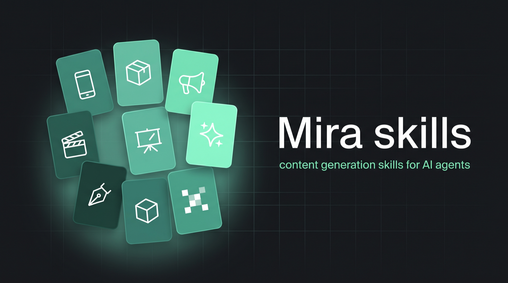

# Mira skills



[](./LICENSE)
[](./VERSION)
[](#what-is-inside)
[](https://agentskills.io)
[](https://github.com/Global-AI-Group-Inc/content-generation-skills/actions/workflows/check.yml)

Skills for AI agents that generate images, video and 3D on [Mira AI](https://mira.mybots.pro). Ten of them are playbooks: UGC, product, ads, cinematic, explainer, anime, illustration, 3D toon, pixel art, 3D model. Pass a playbook id as the `skill` parameter of `generate_video`, `generate_image` or `generate_3d` and the platform's prompt pipeline applies the genre's doctrine itself. Five are knowledge: how to drive the Mira MCP server, how the fourteen video models differ, how the image models differ, the camera, light, look, rhythm and continuity banks the pipeline is built on, and how to build and shoot scenes in the user's own Blender through the bridge tools.

Works with Claude Code, Codex, Cursor and any agent that reads `SKILL.md` files. Generation runs through the Mira MCP server at `https://mcp.mybots.pro/mcp`, signs in with your Mira account and spends your own credits. No API keys.

## Install

```bash
npx skills add Global-AI-Group-Inc/content-generation-skills
```

Claude Code marketplace:

```
/plugin marketplace add Global-AI-Group-Inc/content-generation-skills
/plugin install mira@mira
```

Then connect the MCP server in your agent. The page at [mira.mybots.pro/mcp](https://mira.mybots.pro/mcp) has the exact config for each client.

## What is inside

| Skill | Kind | What it does |
|---|---|---|
| `mira-blender-scene` | core | Build and shoot scenes in the user's own Blender through the `blender_*` tools: blockout in metres, lights, camera, keyframes, generated assets, playblast → video model. |
| `mira-generate` | core | Drive the Mira MCP tools: connect, pick a model, attach brand assets, generate, wait, extend, upscale, build 3D and rig it. Explains what the pipeline keeps and what it fills in. |
| `mira-video-prompting` | knowledge | Which of the fourteen video models to pick and what each one actually does with a prompt. One reference file per recommended model. |
| `mira-image-prompting` | knowledge | The image models and the craft banks for stills: light, optics, composition, grade, materials, and the words that hurt. |
| `mira-craft` | knowledge | The camera, light, look, rhythm and continuity banks the pipeline reads. Generated from the live registry. |
| `mira-ugc` | playbook | Phone-shot creator content: review, unboxing, how-to, testimonial. |
| `mira-product` | playbook | The product as the hero: studio, lifestyle, hands. |
| `mira-ads` | playbook | Short paid creative with a hook in the first beat and a clean closing frame. |
| `mira-cinematic` | playbook | One strong image, film light and optics. |
| `mira-explainer` | playbook | Show how it works in plain light and plain framing. |
| `mira-anime` | playbook | Hand-drawn animation, not footage. |
| `mira-illustration` | playbook | Drawn and painted artwork in motion. |
| `mira-toon3d` | playbook | Stylised 3D animation and CGI key visuals. |
| `mira-pixel` | playbook | Pixel art on a visible grid. |
| `mira-3d` | playbook | One object as a 3D model: text or photos → GLB/FBX/OBJ/USDZ, optional PBR and a rigged humanoid with animation clips. |

Playbook ids are the last part of the skill name: `mira-ugc` is `skill: "ugc"`.

## How the playbooks work

The platform keeps every decision you state in the prompt and fills only the craft you left out. A playbook adds one more layer: the doctrine of a genre goes into the planning step of the pipeline, so a UGC clip gets handheld framing, window light and imperfect texture without you writing any of it. You describe the subject and the moment. The playbook and the pipeline do the rest.

Each playbook also carries a short interview: two or three questions with fixed options. In an agent, ask them in chat when the answer is not obvious. In the Mira composer they show up as quick-answer chips. Skip a question and the default applies.

## Repository layout

```
skills/<name>/SKILL.md       the router; short on purpose
skills/<name>/references/    the detail, read one file at a time
catalog.json                 index used by Mira's own agent and by the MCP server
scripts/check.mjs            frontmatter, line limits, banned words, bank keys
scripts/build-catalog.mjs    regenerates catalog.json
scripts/export-visual-guides.mjs   copies skills to Mira's shelf
scripts/sync-mcp-snapshot.mjs      copies skills into the MCP server build
VERSION                      bump on every content change
```

Files marked `generated from the registry` are written by `build_skills.py` in the platform repo. Edit the registry, not the file.

## Contributing

Open a pull request. Keep `SKILL.md` under 150 lines, write in English, and run `node scripts/check.mjs` before pushing. Doctrines must not contain bank keys such as `push_in` or `rembrandt`: those are for choosing, the prompt gets the described light or move in plain words.

## License

MIT, copyright Global AI Group, Inc. (the company behind Mira AI). Attribution is welcome, not required.
